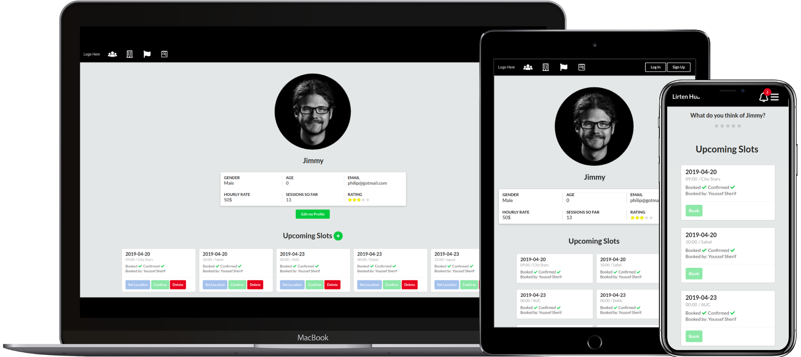

# LirtenHub

A full-stack web platform that connects **members** seeking professional development opportunities with **partners** (companies) offering vacancies, and **life coaches** providing mentorship slots. The platform features intelligent vacancy recommendations powered by [Recombee](https://www.recombee.com/), real-time push notifications via Firebase, and a review/feedback system to maintain service quality.



## Tech Stack

| Layer            | Technology                                          |
| ---------------- | --------------------------------------------------- |
| Frontend         | React, Redux, React Router, Semantic UI React       |
| Backend          | Node.js, Express                                    |
| Database         | MongoDB (Mongoose ODM)                              |
| Auth             | Passport.js, JWT, bcrypt                            |
| Recommendations  | Recombee (collaborative filtering)                  |
| Notifications    | Firebase Cloud Messaging                            |
| Email            | Nodemailer                                          |
| Testing          | Jest                                                |

## Features

- **Member profiles** with skills, interests, availability, and location
- **Partner profiles** for companies posting vacancies
- **Life coach profiles** with bookable mentorship slots
- **Vacancy search** with skill-based and AI-powered recommendations
- **Job applications** with accept/reject workflow
- **Slot booking** for life coaching sessions
- **Review & feedback system** between members and partners
- **Real-time push notifications** for application updates, slot bookings, and more
- **Admin panel** for user management and platform oversight
- **Password recovery** via email

## Architecture

```
client/              React SPA (Create React App)
+-- components/      Reusable UI (menus, profiles, vacancies, feedbacks, ...)
+-- pages/           Route-level page components
+-- actions/         Redux action creators
+-- reducers/        Redux reducers
+-- services/        Axios HTTP client

server/              Express REST API
+-- routes/api/      Route handlers (users, vacancies, jobApplications, ...)
+-- models/          Mongoose schemas (User, Vacancy, JobApplication, ...)
+-- services/        Recommendations, Firebase, email, profile update logic
+-- middleware/       Request logging, Passport auth
+-- validations/     Joi request validation
+-- config/          DB connection, Passport strategy
+-- tests/           Jest integration tests
```

## Getting Started

### Prerequisites

- [Node.js](https://nodejs.org/) (v12+)
- [MongoDB](https://www.mongodb.com/) (local or Atlas)
- A Firebase project (for push notifications)
- A Recombee account (for recommendations)

### Installation

```bash
# Clone the repository
git clone https://github.com/<your-username>/LirtenHub.git
cd LirtenHub

# Install server dependencies
npm install

# Install client dependencies
npm run client-install
```

### Configuration

1. Create `config/keys_dev.js`:

```js
module.exports = {
  mongoURI: "your-mongodb-connection-string",
  secretOrKey: "your-jwt-secret"
};
```

2. Create `services/adminKey.json` with your Firebase Admin SDK credentials.

3. Set the Recombee environment variables or update `services/recommendations.js` with your API credentials.

### Running

```bash
# Run both server and client concurrently
npm run dev

# Or run them separately:
npm run server   # Express API on port 3000
npm run client   # React app on port 3001
```

### Testing

```bash
npm test
```

Runs the Jest test suite covering all API endpoints (users, vacancies, job applications, slots, reviews, feedback, admin operations).

## Environment Variables

For production, set the following:

| Variable          | Description                        |
| ----------------- | ---------------------------------- |
| `MONGO_URI`       | MongoDB connection string          |
| `SECRET`          | JWT secret key                     |
| `RECOMBEE_DB`     | Recombee database name             |
| `RECOMBEE_API_KEY`| Recombee API key                   |
| `NODE_ENV`        | Set to `production` for prod build |

## Authors

- **Philip Mouris**
- **Youssef Sherif**
